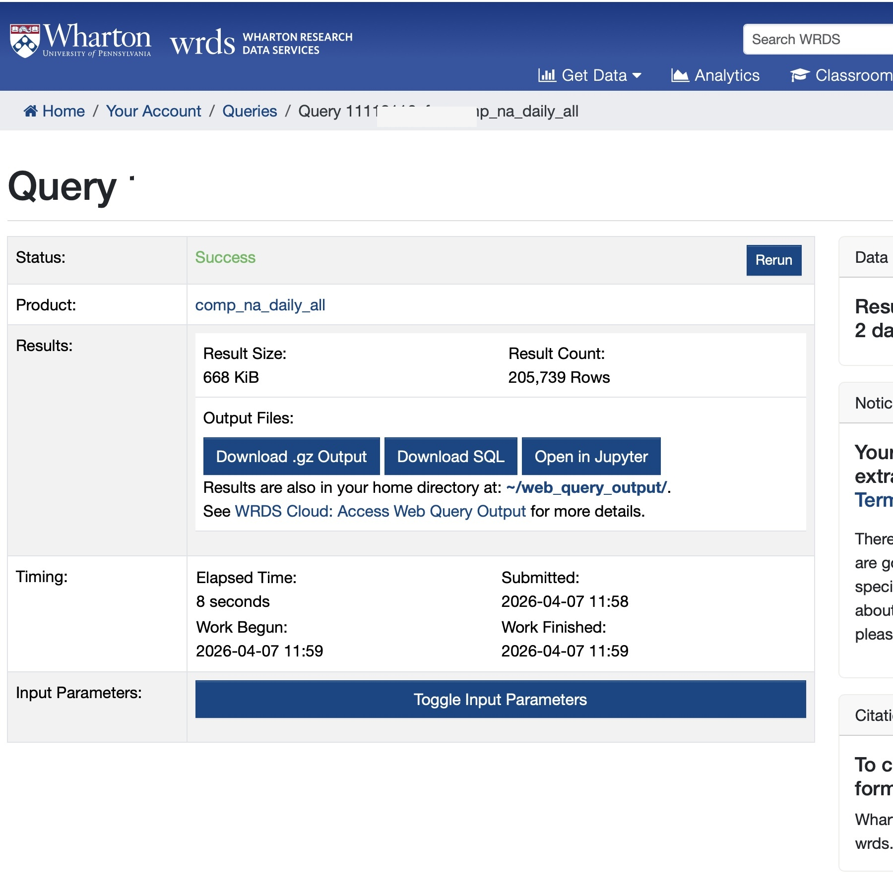

One way to get data from WRDS is the so-called web query interface.
While the WRDS documentation for this feature is characteristically poor, one video on the site demonstrates the process for getting data from Compustat, a leading database of financial statement information.

The video starts with the landing page for WRDS, then selected "Compustat - Capital IQ", then "North America" under "Compustat", then "Fundamentals Annual".
This then lands the user on the web query page for that data set.


According to the video, there are always four steps with the web query.

1. Choose your date range. I will follow the video and leave this at the default setting of 15 years of data.
2. Apply your company codes. Here the video enters a handful of tickers.
I am going to instead select "Search the entire database".
3. Choose variables. Here I will just keep the default option.
4. Select your query output. Here the video presenter chooses Excel.
No-one should ever use Excel in serious research (see [here](https://iangow.github.io/notes/published/spreadsheets.html)).
I will choose "comma-delimited text" for output format, "gzip" for compression type, and `YYYY-MM-DD.` for date format (agai, this is the only acceptable option for research purposes).
Note that this last step does not much matter, though I think we may want to keep the size of the input to a minimum.

I then enter my email address and then check the box to save the query (I select the name `web_query`).
I then click "Submit Form".

I then have to wait for the query to run, after which I can go to a page like the one shown in @fig-web-query-result.

{#fig-web-query-result}

The next step is *not* to "Download `.gz` output", but to "Download SQL".
In this case the downloaded SQL looks like

```sql
SELECT
    comp_na_daily_all.funda.costat,
    comp_na_daily_all.funda.curcd,
    comp_na_daily_all.funda.datafmt,
    comp_na_daily_all.funda.indfmt,
    comp_na_daily_all.funda.consol,
    comp_na_daily_all.funda.tic,
    comp_na_daily_all.funda.datadate,
    comp_na_daily_all.funda.gvkey

FROM comp_na_daily_all.funda
LEFT JOIN (
    SELECT
        gvkey
    FROM comp_na_daily_all.company
) AS id_table 

ON comp_na_daily_all.funda.gvkey = id_table.gvkey

WHERE comp_na_daily_all.funda.datadate BETWEEN
    '2010-01-01'::date AND '2026-04-30'::date
  AND ("comp_na_daily_all"."funda"."consol" = ANY (ARRAY['C']) 
  AND "comp_na_daily_all"."funda"."indfmt" = ANY (ARRAY['INDL','FS']) 
  AND "comp_na_daily_all"."funda"."datafmt" = ANY (ARRAY['STD']) 
  AND "comp_na_daily_all"."funda"."curcd" = ANY (ARRAY['USD','CAD']) 
  AND "comp_na_daily_all"."funda"."costat" = ANY (ARRAY['A','I']))
```

We can easily clean this up to remove unnecessary elements (e.g., the `LEFT JOIN` and the `comp_na_daily_all.` prefixes) and add a few columns of interest (obtained from [here](https://iangow.github.io/far_book/prediction.html)), resulting in the following:

```sql
SELECT 
    gvkey, datadate, indfmt, consol,
    tic, curcd, costat, act, ap, at, ceq, che, cogs, csho, dlc, 
    dltis, dltt, dp, ib, invt, ivao, ivst, lct, lt, ni,
    ppegt, pstk, re, rect, sale, sstk, txp, txt, xint, prcc_f
FROM comp_na_daily_all.funda
WHERE datadate BETWEEN DATE '2010-01-01' AND DATE '2026-04-30'
  AND consol = 'C'
  AND indfmt IN ('INDL', 'FS')
  AND datafmt = 'STD'
  AND curcd IN ('USD', 'CAD')
  AND costat IN ('A', 'I');
```

Now, I can run the following Python code (`query` is just copy-pasted from above):

```{python}
%%time
from db2pq import wrds_sql_to_pq

query = """
SELECT 
    gvkey, datadate, indfmt, consol,
    tic, curcd, costat, act, ap, at, ceq, che, cogs, csho, dlc, 
    dltis, dltt, dp, ib, invt, ivao, ivst, lct, lt, ni,
    ppegt, pstk, re, rect, sale, sstk, txp, txt, xint, prcc_f
FROM comp_na_daily_all.funda
WHERE datadate BETWEEN DATE '2010-01-01' AND DATE '2026-04-30'
  AND consol = 'C'
  AND indfmt IN ('INDL', 'FS')
  AND datafmt = 'STD'
  AND curcd IN ('USD', 'CAD')
  AND costat IN ('A', 'I');
"""

wrds_sql_to_pq(query, "features", "my_project")
```

Now I have a file that I can load into Python or R or whatever modern data analysis package I might be using.

Note that as an alternative to using `wrds_sql_to_pq`, I could just choose to get the entire table.
In this case, it might be simpler to refer to `comp_na_daily_all.funda` using its alias `comp.funda` (this facilitates reproducibility for some WRDS tables).
Because I am getting more data, this will take longer.
In this second case, I will have used the web query simply to identify the table I want to download.

```{python}
#| eval: false
from db2pq import wrds_update_pq

wrds_update_pq("funda", "comp")
```